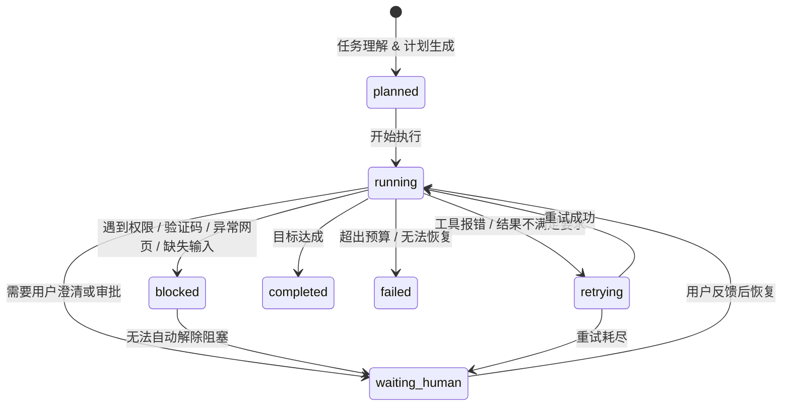

# 一、统一分析框架：Agent = LLM + Memory + Tools + Runtime

本文统一使用以下核心框架统领全文：`Agent = LLM（推理引擎） + Memory（记忆体系） + Tools（工具集） + Runtime（运行时）`。

## 1. 核心组件定义

今天不同 Agent 产品的真正差异，不在于“会不会聊天”，而在于这四个部件的组合方式不同：

- **LLM（大脑）**：系统的理解、推理、规划与生成核心，决定“怎么想”。
- **Memory（状态与上下文）**：保存任务状态、执行工件与长期偏好，本质是状态管理而非单纯聊天记录，决定“记住什么、当前到哪一步”。
- **Tools（执行器）**：操作系统外部世界的接口（如浏览器、文件系统、代码环境、数据库），决定“能对外部世界做什么”。
- **Runtime（中枢引擎）**：将上述三者组织成可用流程的控制流，决定“系统怎么运转、失败后怎么恢复、何时终止”。

## 2. Runtime 执行引擎流转

Runtime 的核心并非简单的按序执行，而是一个**带状态反馈的循环控制流**。其标准流转机制如下：

![[Manus调研与落地建议_20260327160753720.svg]]

## 3. 关键概念辨析：Tool 与 Skill

在深入后续分析前，需明确 `Tool` 与 `Skill` 的核心差异。两者并非同义词：

- **Tool（工具）**：底层的原子化操作能力。决定“能做什么动作”（如：调用搜索 API、读取本地文件）。
- **Skill（技能）**：面向特定任务的**动态可插拔上下文**。通常包含 Workflow、业务规则、最佳实践、Prompt 模板及绑定的 Tools。决定“遇到某类任务时，应该带着什么套路和方法去做”。

---

# 二、Manus：面向长任务的云端执行引擎

## 2.1 产品定位

Manus 更像一个 **Action Engine（执行引擎）**，而不是传统聊天机器人。它向用户交付的核心价值不是“回答问题”，而是“替你完成一个长链条任务”。

因此，Manus 的系统重心天然落在：

- 长任务执行
- 外部工具操作
- 运行时稳定性
- 可见执行体验

从产品体验上看，Manus 还有一个非常鲜明的特征：**它把绝大多数复杂性封装在系统内部，对用户尽量呈现为简单、直接、易用的使用体验。** 用户感知到的是一个“能把事情做完的产品”，而不是一套暴露了复杂运行机制的系统。

## 2.2 LLM：多模型协同，而不是单模型神话

从公开材料与行业判断看，Manus 的优势并不主要来自某一个神秘超强模型，而更像来自 **多模型协同 + 工程封装**。

常见理解是：

- 强推理模型负责任务规划、拆解和关键决策
- 更轻或更特化的模型负责具体执行、格式化和工具交互

如果把它再拆细一点，Manus 背后的 `LLM` 角色通常更像是分层协作，而不是一个模型从头跑到尾：

- **Planner / Router**：判断任务类型、拆分阶段、决定下一步该用哪类能力
- **Executor**：围绕当前子任务生成代码、调用工具、读取返回结果并继续推进
- **Critic / Verifier**：检查结果是否偏题、是否报错、是否满足交付要求
- **Formatter**：把最终结果整理成用户可消费的报告、表格或结构化产物

这种分工不一定表现为显式的多 Agent，也可能只是同一系统里不同提示模板、不同模型档位、不同调用策略的组合。但无论实现方式如何，本质都是把“高成本强推理”集中用在关键决策点，而把大量低层执行交给更便宜、更快、更稳定的路径。

这意味着 Manus 的价值重心不是“模型独占”，而是“如何把模型能力放进一个更强的系统里”。

## 2.3 Memory：把上下文当成稀缺资源管理

Manus 面向长任务，无法将所有网页内容、对话历史、执行日志持续塞回模型——这会导致成本上升、上下文噪音膨胀、中间步骤迷失。其核心策略是：将抓取结果与中间产物外置为工件，上下文只保留当前决策必须的摘要、计划与状态，并维护稳定前缀以提高缓存命中率。

**Manus 真正管理的不是"聊天记录"，而是四类不同生命周期的状态：**

| 状态类型 | 内容 |
|---|---|
| **任务级** | 目标、约束、交付物定义、优先级 |
| **执行级** | 当前步骤、子任务依赖、失败原因、待重试动作 |
| **工件级** | 抓取的网页、生成的文件、代码片段、表格、截图 |
| **用户级** | 用户补充的偏好、澄清信息、审批结果 |

这四类状态对应三层存储温度：

| 层级 | 存储位置 | 内容策略 |
|---|---|---|
| **热**（Hot） | 当前上下文 | 仅保留"下一步决策必须知道"的信息 |
| **温**（Warm） | 任务 Plan / 步骤日志 / 摘要卡片 | 供中途恢复与回看 |
| **冷**（Cold） | 文件 / 缓存 / 工件仓库 | 必要时检索回流 |

一个成熟的长任务系统还需要明确写入策略：阶段结束后是否压缩为摘要；工具输出过长时保留全文还是引用路径；连续失败后是否将失败模式写入任务状态；用户改目标后是否重写 todo 与优先级。

**Manus 的 Memory 核心不是"存得更多"，而是"更干净、更可恢复"。**

## 2.4 Tools：CodeAct 是最具代表性的特征

Manus 最有代表性的标签之一是 **CodeAct**。它不是完全依赖预先注册的一组静态工具，而是给 Agent 一个隔离执行环境，让它在需要时直接写 Python / Shell 去解决问题。

这带来的好处是：

- 泛化能力更强
- 不需要为每个场景都预置一堆工具
- 代码执行报错本身可以成为下一轮修正输入
- 工具边界从“有限 API”扩展到“代码空间”

但代价也很明显：

- 运行环境更重
- 安全边界要求更高
- 调试链路更复杂
- 成本显著高于普通函数调用

如果从工具层再展开，Manus 的核心工具簇大致可以理解为：

- **浏览器与网页操作**：打开页面、点击、输入、滚动、抓取 DOM、截图
- **代码执行环境**：运行 Python / Shell、安装轻量依赖、处理文件与数据
- **文件系统工具**：读写文档、生成中间文件、输出最终工件
- **网络与检索能力**：搜索、抓取、抽取结构化信息
- **观察与诊断工具**：查看报错、读取日志、根据失败结果回修代码

这几类工具之所以关键，是因为它们能把“回答一个问题”升级成“完成一个任务”。也就是说，Manus 的工具不是给模型加一点插件，而是给模型一个可操作环境。

但要注意，真正决定体验上限的并不是“工具数量多”，而是三个能力：

- **工具选择是否准确**：什么时候该直接读网页，什么时候该写脚本处理
- **工具结果是否可反馈**：报错、页面变化、空结果能否成为下一轮输入
- **工具输出是否工件化**：结果能否落为文件、报告、表格，而不是只停在上下文里

因此，CodeAct 更适合高价值、高复杂度、开放环境任务，而不适合作为所有内部场景的默认起点。

## 2.5 Orchestrator：真正最难复制的部分

Manus 最难复制的部分在 `Orchestrator`。长任务系统天然面对工具失败、网页异常、状态变化、用户接管、环境中断、成本失控等不确定性，这要求执行引擎具备：分阶段推进、失败重试与回退、状态快照与恢复、人工接管接口、成本与时长控制。

**Orchestrator 的核心是一个任务状态机，而非简单的 `while(true)` agent loop：**

支撑这个状态机的关键运行机制：

- **任务分段**：先研究、再执行、再汇总，分阶段推进而非一次性全跑
- **预算控制**：限制步骤数、模型调用量、执行时长与工具开销
- **异常分类**：网页加载失败 / 脚本报错 / 结果不满足要求，对应不同处置路径
- **人工接管接口**：关键节点允许用户补充信息、批准操作或直接接手浏览器
- **恢复点设计**：重启后从阶段摘要、工件索引与最近稳定状态继续

浏览器操作只是 Manus 的外显能力，真正昂贵的是这套面向失败、面向恢复、面向长任务不确定性的运行时治理体系。

## 2.6 体验层启发：可见执行

Manus 非常强的一点，是让用户“看见它在做事”。无论是浏览器操作还是任务推进，用户可以感知：

- 它做到哪一步了
- 它在处理什么
- 它什么时候失败
- 什么时候可以接管

这极大缓解了黑盒系统的不信任感。对于任何内部 Agent 产品，这一点都非常值得借鉴。

## 2.7 对 Manus 的小结

从四元结构看，Manus 的路线可以概括为：

- **LLM**：多模型协同
- **Memory**：长任务上下文压缩 + 工件外置
- **Tools**：CodeAct，能力边界极宽
- **Orchestrator**：重型任务编排、恢复、接管

它代表的是一种 **重执行、重 runtime、重基础设施** 的路线。

---

# 三、OpenClaw：面向私域环境的本地控制平面

## 3.1 产品定位

如果说 Manus 更像“执行引擎”，那么 OpenClaw 更像 **本地 Control Plane / Agent OS 倾向系统**

它的重点不是“把任务都放到云里跑”，而是把：

- 模型接入
- 多种工具能力
- 渠道入口
- 状态管理
- UI 呈现
- 审批与控制

统一组织到一个本地优先的中枢里。

## 3.2 LLM：模型重要，但平台更重要

OpenClaw 并不把自己塑造成“自带独家最强模型”的产品，而更像一个可以接多种模型的系统层容器。

这意味着在 OpenClaw 路线里：

- 模型是可替换的
- 平台能力比单一模型更重要
- 系统价值更多沉淀在控制平面，而不是模型本身

如果拆到系统实现层，OpenClaw 对 `LLM` 的使用更像“能力编排接口”而不是“唯一大脑”。它更关心的是：

- 哪类任务默认走哪类模型
- 哪些步骤需要强推理，哪些步骤只需要低成本生成
- 模型输出如何进入技能、审批、UI 和状态流转

因此，这条路线里的 `LLM` 常常承担三种角色：

- **理解器**：理解用户意图、识别任务类别、补全结构化参数
- **调度辅助器**：帮助选择技能、生成执行计划、解释当前状态
- **内容生成器**：负责最终回答、报告整理、UI 文案与中间说明

这和 Manus 有一个微妙差异：Manus 更强调“模型驱动执行”，而 OpenClaw 更强调“模型嵌入控制平面”。前者是在复杂任务里尽可能替人做完，后者是在复杂系统里让模型成为一个可插拔、可治理的组件。

这种思路尤其适合私域环境，因为它降低了对单一厂商的依赖。

## 3.3 Memory：文件系统化、Markdown 化、渐进式展开

**OpenClaw 的 Memory 核心哲学：记忆即 MD 文件，少即是多。** 所有系统记忆尽量外置为 Markdown 文件，而非藏于黑盒状态——这既符合 AI 对文档结构的天然适配，也满足工程上的可读、可审计、可版本化要求。

OpenClaw 将 Memory 拆解为五类显式对象：

| 对象类型 | 内容 | 生命周期 |
|---|---|---|
| **Rules / Constitution** | 系统级约束、权限边界、行为原则 | 长期稳定 |
| **Skills** | 某类任务的 SOP、参数说明、输入输出约定 | 按需更新 |
| **Profile / Long-term Memory** | 用户偏好、长期背景、稳定约束 | 长期沉淀 |
| **Session Summary** | 会话压缩状态、未完成事项、关键结论 | 会话级 |
| **Artifacts** | 生成的报告、截图、结构化结果、索引 | 任务级 |

与此同时，OpenClaw 强调 **Progressive Disclosure（渐进式展开）**：平时只保留技能元数据，匹配到任务时再加载完整技能说明，不把所有规则一次性压进上下文。这能有效控制上下文长度、降低指令干扰、提高可调试性。

这类设计的最大优势不是"记忆很聪明"，而是"**记忆很显式**"：人可以直接打开文件查看、团队可以 review、Git 可以追踪变化、系统可以按需加载。

要让这套路走通，还需解决四个工程问题：**写入策略**（何时更新长期记忆 vs 会话摘要）、**命中策略**（当前任务该加载哪些技能与规则）、**冲突解决**（旧记忆与新输入矛盾时以谁为准）、**衰减机制**（哪些记忆长期保留，哪些定期压缩归档）。

现实判断：这一路线目前**把记忆介质选对了，但记忆机制尚未成熟**。"文档即记忆"要真正成立，仍需更稳定的写入、压缩、命中与路由策略，否则很容易停留在"有很多可读文档"，而非形成稳定服务任务执行的记忆系统。

## 3.4 Tools：MCP + Skills 是核心能力组织方式

OpenClaw 的工具路线更偏向标准化和治理，其代表性组合是：

- **MCP**：把外部系统能力标准化接入
- **Skills**：把任务经验、SOP 和过程知识模块化沉淀

这条路线的优点是：

- 工具边界更清晰
- 更适合长期积累
- 更适合团队复用
- 更适合企业内部做能力治理

`MCP + Skills` 实际上把“工具”拆成了两层：

- **MCP 层**：定义系统能连接哪些外部能力，例如搜索、文件、知识库、审批系统、第三方服务
- **Skill 层**：定义这些能力该如何在特定任务里被组合使用，包括步骤、参数、输入输出格式和注意事项

OpenClaw 的工具因此是“接口层 + 经验层”的组合：MCP 解决“能连什么”，Skill 解决“怎么用得像一个稳定流程”。

这会自然导向几类核心工具资产：

- **连接器类工具**：搜索、网页读取、知识库、数据库、消息渠道
- **生产类工具**：文件生成、模板填充、结构化输出、表单提交
- **治理类工具**：审批、权限确认、日志记录、审计回放
- **交互类工具**：Canvas / A2UI 之类的结构化前端呈现

这种设计的强项不是开放世界里的极限泛化，而是企业环境里的可控协作。它希望把工具从“模型临时会不会用”变成“组织长期可维护的能力资产”。

相比 Manus 的 CodeAct，OpenClaw 更像是在说：

> 不是先给系统无限能力，而是先把能力变成可管理、可装载、可审计的资产。

这条路线的方向我认为是对的，但从产品完成度看，它目前更像一个**有明确设计思想的能力组织框架**，而不是一个默认路由就已经非常成熟的产品。也就是说，`MCP + Skills` 解决了“能力如何组织”的问题，但还没有完全解决“能力如何稳定命中、稳定协同、稳定交付”的问题。

## 3.5 Orchestrator：控制平面的真正价值都在这里

OpenClaw 的关键不在“会不会调一个模型”，而在它如何治理整个运行时：

- 管理不同会话和 channel 的状态
- 管理工具执行顺序
- 处理审批与授权
- 支持后台周期性任务唤醒
- 为前端提供一个可观测的工作台

这意味着 OpenClaw 的 `Orchestrator` 更接近一个带状态治理能力的控制总线。它不仅要决定“下一步调用哪个模型或工具”，还要决定：

- 当前请求属于哪个 workspace / session / channel
- 是否具备执行某个动作的权限
- 该动作是否必须进入审批流
- 当前任务结果要写回哪里、展示给谁、以什么形式持久化

其核心维护四类状态对象：

- **Session State**：当前会话上下文、已加载技能、临时变量
- **Task State**：任务阶段、负责人、待办、状态迁移
- **Permission State**：当前授权级别、待审批动作、执行许可
- **UI State**：哪些信息需要展示给前端、哪些需要等待用户反馈

因此，OpenClaw 的调度难点不在“会不会自动执行”，而在“会不会把系统管乱”。一个可用的控制平面须满足：

- 多入口进来后状态不串
- 多工具调用后权限不乱
- 多轮任务推进后记忆不脏
- 人工审批插入后流程不崩

这说明 OpenClaw 的 Orchestrator 更像一个 **系统中枢**，而不是一个普通聊天循环。

不过从现实体验看，它现在更准确的定位可能不是“已经成熟的控制平面产品”，而是“**已经能看出控制平面雏形，但路由质量、默认行为稳定性和整体完成度仍然不足**”。这也是为什么它会给人一种“不是不能用，但也还没有被打磨成低心智负担产品”的感觉。

## 3.6 UI 路线：Canvas / A2UI 的意义

OpenClaw 的另一条重要路线是结构化 UI。它不是把执行过程做成视频流，而是通过结构化协议把界面描述交给前端渲染。

这种方式更适合：

- 表单
- 审批
- 进度状态
- 数据展示
- 任务面板

它的意义在于：

- 比视频流更轻量
- 比纯聊天更可控
- 比任意前端代码执行更安全

## 3.7 对 OpenClaw 的小结

从四元结构看，OpenClaw 的路线可以概括为：

- **LLM**：模型可插拔
- **Memory**：Markdown 文件化记忆与渐进加载
- **Tools**：MCP + Skills，强调标准化治理
- **Orchestrator**：Gateway、Session 管理、审批、控制平面

它代表的是一种 **重治理、重私域、重控制平面** 的路线。

但如果加入现实完成度判断，我会更倾向于把它定义为：**方向正确、局部可用、但整体仍偏半成品的控制平面样本。** 它最值得借鉴的不是“已经足够成熟的产品体验”，而是它把控制平面、文档记忆、技能沉淀和结构化 UI 这些关键方向较早暴露了出来。

---

# 四、DeerFlow：开源化的执行骨架

如果说 `Manus` 更像已经被封装成产品体验的执行器，`OpenClaw` 更像控制平面路线的样本，那么 `DeerFlow` 更像一个 **把长任务执行 runtime 开源出来的工程底座**。

DeerFlow 四元结构速览：

| 维度 | DeerFlow 路线 |
|---|---|
| **LLM** | 模型可替换，重点在多步任务中的 runtime 调度；模型是被放进 harness 的推理部件，而非全部系统 |
| **Memory** | 会话内摘要压缩 + 文件外置；会话外支持本地长期记忆（`profile`、`preferences`、`accumulated knowledge`） |
| **Tools** | `Skills + Tools + Sandbox` 组合；内置 `web search`、`web fetch`、`file operations`、`bash execution`，支持 `MCP servers` 与 `Python functions` 扩展 |
| **Orchestrator** | `lead agent + sub-agents + filesystem + sandbox` 协同驱动；复杂任务可拆为多子任务并行，形成"拆解→执行→外置→汇总"完整执行链 |

代表路线：**重执行骨架、重自托管、重工程可扩展性**。

**现实判断**：比一般开源 Agent 更完整，但整体仍更像工程底座而非高度打磨的成品；可将其理解为**开源、开发者友好的 mini Manus**。
 
 ---
 
# 五、Manus、OpenClaw 与 DeerFlow 的核心差异
 
三者分别代表三个不同的系统落点：`Manus` 更偏向**执行引擎产品**，`OpenClaw` 更偏向**控制平面 / Agent OS 雏形**，`DeerFlow` 更偏向**开源 super agent harness**（详见第四章）。各维度对比如下：

| 维度 | Manus | OpenClaw | DeerFlow |
|---|---|---|---|
| **产品重心** | 执行引擎 | 控制平面 | 开源 super agent harness |
| **核心目标** | 把长链条任务尽量替用户做完 | 把多入口、多工具、多记忆统一治理 | 给 Agent 提供可直接运行复杂任务的通用 runtime 底座 |
| **LLM 使用方式** | 多模型协同执行，强调规划与落地闭环 | 模型可替换，平台优先，强调解耦 | 模型可替换，围绕 harness 做多步任务调度与分工 |
| **Memory 重点** | 长任务上下文压缩、工件外置、状态聚焦 | Markdown 文件化记忆、渐进加载、长期沉淀 | 会话内摘要压缩 + 文件外置 + 本地长期记忆 |
| **Tools 重点** | CodeAct，动态代码执行，工具边界更开放 | MCP + Skills，标准化治理，能力模块化 | Skills + Tools + Sandbox，兼顾执行能力与可扩展性 |
| **Orchestrator 重点** | 让长任务稳定跑完，减少中途失控 | 让多渠道、多工具、多状态被统一编排 | 用 lead agent + sub-agents + sandbox 跑长链条任务 |
| **交互重点** | 让用户看见执行过程，强化“它在做事”的感知 | 让用户看见状态、结构化界面与可审计结果 | 更强调 runtime 能力与结果交付，产品感弱于 Manus |
| **优势来源** | 强执行闭环、强泛化能力、强过程可见性 | 强控制能力、强可扩展性、强私域数据主权 | 开源可拆解、默认能力完整、自托管友好、长任务能力较强 |
| **当前完成度判断** | 已体现出较强产品封装与长任务闭环能力 | 可用但未成熟，更像方向明确的控制平面半成品 | 比一般开源 Agent 更完整，但更像工程底座而非高度打磨成品 |
| **典型场景** | 高复杂度长任务执行、跨工具操作、结果导向任务 | 私域环境中的可控 Agent 系统、长期知识沉淀、多入口协同 | 自托管 deep research、复杂 workflow、需要子代理与沙盒执行的任务 |

三者的优势、不足与适用场景对比：

| 维度 | Manus | OpenClaw | DeerFlow |
|---|---|---|---|
| **主要优势** | `CodeAct` 让工具边界几乎无限；长任务上下文工程更成熟；可见执行体验强，用户更容易信任 | 控制平面思路清晰；`MCP + Skills + Markdown` 便于能力沉淀；本地优先，更容易满足隐私与主权要求 | 官方直接内置 `filesystem + memory + skills + sandbox + sub-agents`；长任务骨架完整；开源且易于二次开发 |
| **主要不足** | 云端沙盒、推流与长任务编排成本高；高权限执行带来更强安全与合规压力；工程复杂度高，不易低成本复刻 | 本地高权限同样有供应链与提权风险；复杂开放任务的泛化执行上限可能不如 Manus；开源与模块化意味着更高集成成本 | 产品封装度和默认体验通常弱于 Manus；高权限工具同样带来安全风险；要用好它仍需要较强工程整合能力 |
| **更适合什么** | 重任务、长任务、跨工具任务、结果导向且愿意为执行效率付费的场景 | 私域环境、组织内部场景、需要长期记忆沉淀、需要统一入口与能力治理的场景 | 想快速拥有一个可自托管、可扩展、具备长任务执行骨架的 Agent 系统 |
| **不适合什么** | 高频碎任务、低价值轻问答、权限高度敏感且无法建设沙盒治理的环境 | 期望开箱即用的强执行产品、极度开放且高度长尾的临场任务、缺乏工程维护能力的团队 | 期望像成熟 SaaS 一样开箱即用；完全没有工程能力；无法接受本地高权限运行风险的团队 |
| **对我们的启示** | 借它的任务闭环、工件化输出、上下文压缩和可见执行思路，但不要一开始照搬高权限 CodeAct | 借它的控制平面、技能沉淀、显式记忆和能力分层思路，但不要一开始追求全渠道与高复杂治理 | 借它的开源 runtime 骨架、sub-agent、sandbox、local memory 思路，但不要把“有 harness”误当成“已有成熟产品体验” |

因此，这三个系统不是简单的“谁更强”，而是分别代表了三种不同的系统重心：

- **Manus**：更偏向**把复杂封装起来，让用户简单使用，并把事情做完**
- **OpenClaw**：更偏向**把记忆与能力落成可读的 MD 与模块，把系统管住**
- **DeerFlow**：更偏向**把长任务执行骨架开源出来，让你能自托管、扩展和二次开发**

---

## 5.1 更深层观察：为什么这三条路线都能成立

Manus、OpenClaw 和 DeerFlow 的分野并非偶然的产品包装，而是顺着 Agent 底层约束各自演化出来的。

### **观察一：真正的产品溢价，越来越来自复杂度封装能力**

在强推理模型逐步成为基础设施后，用户真正愿意为之付费的，不再只是模型榜单上的细微分差，而是系统能否把长任务运行时、错误恢复、工具编排和状态治理这些复杂度吞入后台，并向前台输出稳定、低摩擦、低心智负担的体验。

这正是 Manus 最强的地方：用户看到的是一个简单易用、能把事情做完的执行者，而不是背后那套复杂 runtime。

### **观察二：Memory 的关键不是“存得更多”，而是“存得更显式、更可审计”**

对长程 Agent 而言，记忆系统的首要目标并不是把更多历史塞进上下文，而是让状态可以跨会话恢复、跨人员理解、跨阶段复用。一切能够以 Markdown、文件、工件、结构化快照等低惊奇介质外置的记忆，都优于藏在聊天历史里的黑盒状态。

这也是 OpenClaw 很有代表性的地方：**一切记忆尽量落成 MD 文件。** 这种方式既符合 AI 对自然语言与文档结构的适配，也更符合团队协作中的阅读、修改、审计和版本管理习惯。只是从现实完成度看，它更像是把方向指明了出来，而不是已经把这套记忆机制彻底打磨成熟。

### **观察三：可见执行与可接管，不是体验加分项，而是落地前提**

在真实组织环境中，Agent 能否被采纳，不只取决于结果质量，还取决于执行过程是否可见、是否可中断、是否可接管。只给最终答案而不暴露过程的系统，在长任务、高风险、多人协作场景中很难真正建立信任。

这一点上，Manus 的可见执行、OpenClaw 的结构化状态呈现，以及 DeerFlow 的工件化执行环境，本质上都在解决同一个问题：**把黑盒 Agent 变成一个人类可以观察、理解、接管的系统。**

因此，如果把三者放在一起看，可以把它们压缩成一句话：**Manus 更像已经把复杂性封装成产品体验的代表，OpenClaw 更像把控制平面与文档记忆路线暴露得最清楚的参考样本，而 DeerFlow 更像把长任务执行 runtime 开源出来的工程化样本。**

---
